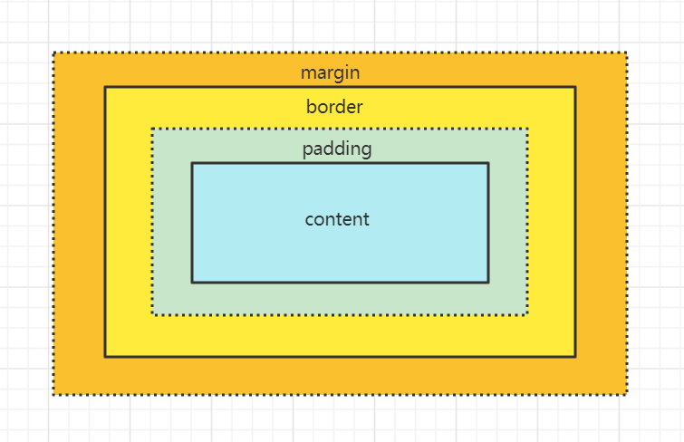

# CSS盒模型
> CSS中所有的元素，都是被一个个盒子所包裹起来的，这种形式我们称之为盒模型，一个盒子从外到内包括：`margin`、`border`、`padding`、`content`。
> [MDN介绍](https://developer.mozilla.org/zh-CN/docs/Learn/CSS/Building_blocks/The_box_model)



盒子又分为：`块级盒子`和`内联盒子`  
+ **块级盒子**
  + 每个盒子都会换行
  + 可以设置width和height
  + `margin`、`border`、`padding`可以撑开别的盒子
+ **内联盒子**
  + 盒子间不会换行
  + 设置width和height无效
  + 垂直方向`margin`、`border`、`padding`会生效，但不会撑开别的内联盒子
  + 水平方向`margin`、`border`、`padding`会生效，会撑开别的内联盒子

## 标准模型和IE模型的区别
### 标准模型
> 宽高指`content`的模型

### IE模型
> 宽高指`padding`+`border`+`content`的模型

### 区别
> 宽高的计算方式不同

### css如何设置标准模型和IE模型？
```css
box-sizing: border-box; // (IE模型)
box-sizing: content-box; //(标准模型，浏览器默认方式)
```

## 拓展
### JS如何获取盒模型对应的宽高？
```javascript
// 获取内联样式的宽高（通过link引入的样式添加的宽高无法计算）
dom.style.width/height

// 渲染后的宽高（只有ie支持）
dom.currentStyle.width/height

// 渲染后的宽高（多浏览器支持）
window.getComputedStyle(dom).width/height

// 通过元素的绝对位置来计算宽高
// 可获取top、bottom、left、right
// ie不支持width属性，可通过right - left来计算
dom.getBoundingClientRect().width/height
```
    
