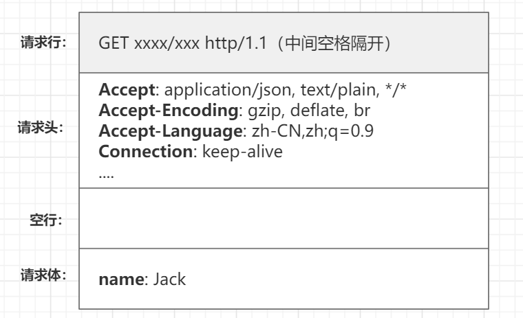
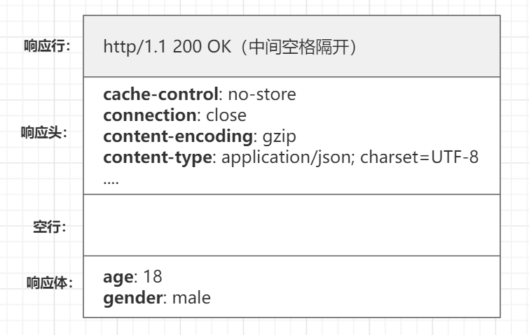

# 什么是HTTP？
> 超文本传输协议（Hyper Text Transfer Protocol，HTTP），通常运行在TCP之上，主要功能是为了，建立起客户端和服务端的沟通桥梁。

## HTTP主要特点
+ `简单快速`
  每个资源固定的(每张图片每个地址)访问只需输入uri
+ `灵活`
  通过一个http协议可以传输不同数据类型
+ `无连接`
  连接一次就会断开，**不会保持连接**
+ `无状态`
  无法判断每次连接都是谁

## HTTP报文
> 客户端与服务端通信的内容，如同两个人互相写信
### 请求报文
> 写给服务端的 "信"
+ `请求行`
  包含：HTTP方法 / 页面地址 / HTTP协议版本

+ `请求头`
  格式：key: value（与服务端进行一些约定，比如：用什么语言写的 "信"；如何看懂我发给你的 "信"）

+ `空行`
  作用：服务端碰到空行就知道下面的内容是请求体了

+ `请求体`
  写给服务端的 "信"

### 响应报文
> 写给客户端的 "信"，具体的含义与请求报文一致
+ `响应行`
  包含：HTTP协议版本 / 状态码 / 状态描述
+ `响应头`
+ `空行`
+ `响应体`

## HTTP方法
> 只是客户端和服务端的一个约定，服务端也可以不遵循，比如客户端发送GET，服务端也可以执行删除操作。但为了代码的可读性和维护性，我们一般是遵循这个规则的。
+ `GET`
  获取资源
+ `POST`
  传输资源
+ `PUT`
  更新资源
+ `DELETE`
  删除资源
+ `HEAD`
  获取报文首部
+ `OPTIONS`
  获取目的资源所支持的通信选项。  
  可以对指定的`URL`使用该方法，也可以对整站使用。一般不会主动发起这个`OPTIONS`请求，这里扯出一个新概念：`简单请求`和`复杂请求`，复杂请求浏览器会自动发起`OPTIONS`请求（比如跨域请求就是一个复杂请求）

## HTTP状态码
> 表示发送过去的"信"的状态（有没有收到等）
### 1xx（指示信息）
> 表示请求已接收，继续处理

### 2xx（成功）
> 表示请求已被成功接收
+ `200 OK`：客户端请求成功
+ `206 Partial Content`：客户发送了一个带有Range头的GET请求，服务器完成了它

### 3xx（重定向）
> 想要完成请求，必须进行更进一步的操作
+ `301 Moved Permanently`：所请求的页面已被转移到新的URL
+ `302 Found`：所请求的页面已被临时转移到新的URL
+ `304 Modified`：客户端有缓冲的文档并发出了一个条件性的请求，服务器告诉客户端，原来的缓冲文档还可以继续使用

### 4xx（客户端错误）
> 请求有语法错误或请求无法实现
+ `400 Bad Request`：客户端请求有语法错误，不能被服务器所理解
+ `401 Unauthorized`：请求未经授权，这个状态码必须和WWW-Authenticate报头域一起使用
+ `403 Forbidden`：对被请求页面的访问被禁止(资源禁止被访问)
+ `404 Not Found`：请求资源不存在

### 5xx（服务器错误）
> 服务器未能实现合法的请求
+ `500 Internal Server Error`：服务器发生不可预期的错误，原来缓冲的文档还可以继续使用
+ `503 Server Unavailable`：请求未完成，服务器临时过载或当机，一段时间后可能恢复正常

## 5层网络模型
> 要了解HTTP，就需要先了解下计算机网络的五层网络模型，知道HTTP在计算机网络中起到什么作用。

### 应用层
> 为应用软件提供了很多服务，构建于TCP协议之上，屏蔽网络传输相关细节。​​

本层相关协议：
+ HTTP
+ FTP

### 传输层
> 向用户提供可靠的端到端（End-to-End）服务

传输层向高层屏蔽了下层数据通信的细节​  

本层相关协议：
+ TCP
+ UDP

### 网络层
> 数据在节点之间传输创建逻辑链路
    
### 数据链路层
> 在通信的实体间建立数据链路连接（01010101）
    
### 物理层
> 定义物理设备如何传输数据（硬件设备）
