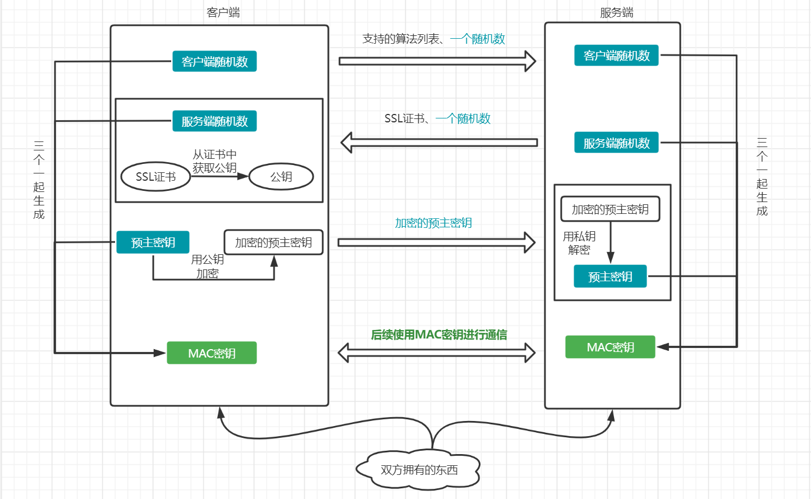

# HTTPS
> HTTPS就是HTTP的加密版本。通常使用SSL（第三方证书）或者TLS（安全传输层协议）来实现，目前使用比较多的是SSL。  
> 可以简单的理解为：使用HTTP就像是两个人明文写信，信的内容很可能被人给看到。使用HTTPS就像把信放在保险箱中，然后再把保险箱交给收信人，而密码只有你们两个人知道（真实的HTTPS使用非对称加密）。
> [维基百科 介绍](https://zh.wikipedia.org/wiki/%E8%B6%85%E6%96%87%E6%9C%AC%E4%BC%A0%E8%BE%93%E5%AE%89%E5%85%A8%E5%8D%8F%E8%AE%AE)

## HTTPS加密流程
> HTTPS协议默认端口443

1. **客户端**：返回`支持的算法列表`、`一个随机数`给服务端（随机数用作后续生成MAC密钥）
2. **服务端**：返回`SSL证书`、`一个随机数`给客户端（随机数用作后续生成MAC密钥）
3. **客户端**：[`获取证书中的公钥`](#获取ssl证书中的公用密钥的过程)、生成一个`pre_master_secret随机密码串`（使用`证书中的公钥`对其进行加密），然后将加密后的`pre_master_secret`返回给服务器
4. **客户端和服务端**：根据 `pre_master_secret` 、`客户端随机数`、`服务端随机数`用同样的规则计算出`MAC密钥`（后续对话使用这个`MAC密钥`进行`对称加密`数据传输），握手过程就结束了

### SSL证书包含什么？
1. 证书的发布机构CA
2. 证书的有效期
3. 公钥（这里的公钥被证书颁发机构的私钥加密过）
4. 证书所有者
5. 签名
6. 其它

### 获取SSL证书中的公用密钥的过程
1. `验证机构是否合法`
   + 客户端接收到证书后，根据证书中记录的机构，从操作系统中取出内置在系统中对应的机构，验证机构是否合法
2. `验证证书是否`
   + 客户端取出`内置在系统中对应机构的公钥`，对服务端返回的SSL证书中的签名进行解密，得出值A
   + 客户端用约定的`hash算法`（类似md5加密）根据证书的内容得出一个值B ，值A与值B对比，对比结果一致，证明服务器发来的证书合法
3. 此时客户端就可以读取证书中的公钥

