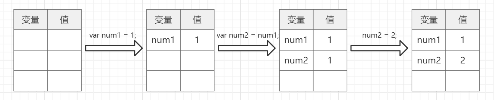
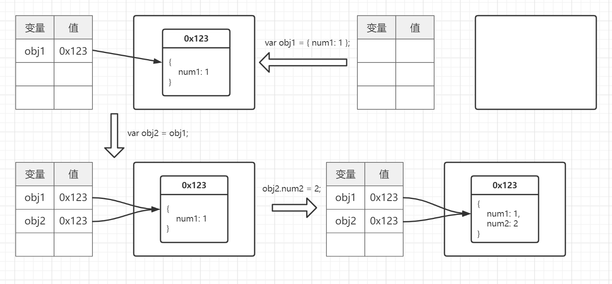

# 数据类型
> JS中`变量没有类型`，值才有，变量可以随时持有任何类型

## 基本类型

+ `number`
+ `string`
+ `boolean`
+ `null`
  
      `typeof null`返回`object`，语言本身的`bug`。
      但`null`是基本类型
+ `undefined`
+ `symbol`（ES6中新增）


## 对象类型

+ `Function`
+ `Array`
+ `Date`
+ `RegExp`
+ `Error`
+ `String`
+ `Number`
+ `Boolean`


## 当我们把值赋值给一个变量时发生了什么？

### 值为基本类型
> `基本类型`的值存在`栈`中

`var num1 = 1;` 发生了什么？  
+ `LHS`查询`num1`，没找到
+ 在栈中开辟一个空间存储`num1`
+ 把`num1`值设为1

`var num2 = num1;` 发生了什么？
+ `LHS`查询`num2`，没找到
+ 在栈中开辟一个空间存储`num2`
+ `RHS`找到`num1`的值为1
+ 把`num2`的值设置为1

`var num2 = 2;` 发生了什么？
+ `LHS`查询`num2`，找到
+ 把`num2`的值设置为2（因为是值引用，不会影响num1）

**图示**：  
  

**demo**：
```javascript
// 基本类型，修改复制的值不会影响旧值
var num1 = 1;
var num2 = num1;
num2 = 2;

console.log(num1); // 1
console.log(num2); // 2
```

### 值为对象类型
> `对象类型`的值存储在`堆`中，然后在`栈`中存储`堆的位置信息`。

`var obj1 = { num1: 1 };` 发生了什么？  
+ `LHS`查询`obj1`，没找到
+ 在栈中开辟一个空间存储`obj1`
+ 在`堆`中开辟空间存储 `{ num1: 1 }`，地址为`0x123`
+ 把`obj1`值设为`0x123`

`var obj2 = obj1;` 发生了什么？
+ `LHS`查询`obj2`，没找到
+ 在栈中开辟一个空间存储`obj2`
+ `RHS`找到`obj1`的值为`0x123`
+ 把`obj2`的值设置为`0x123`

`obj2.num2 = 2;` 发生了什么？
+ `LHS`查询`obj2`，找到堆的地址`0x123`
+ 根据地址`0x123`找到对象中`num2`为空，在对象中创建`num2`
+ 把`num2`的值设置为2
+ 因为是根据`地址`修改的对象，所以所有`指向这个地址的变量`的都会发生变化

**图示**：  
  


**demo**:
```javascript
// 对象类型，修改复制的值会影响旧值
var obj1 = {
  num1: 1
};

var obj2 = obj1;
obj2.num2 = 2;

console.log(obj2.num2); // 2
console.log(obj1.num2); // 2
```

**tips**:
`函数的参数`如果是`对象类型`也是`地址引用`