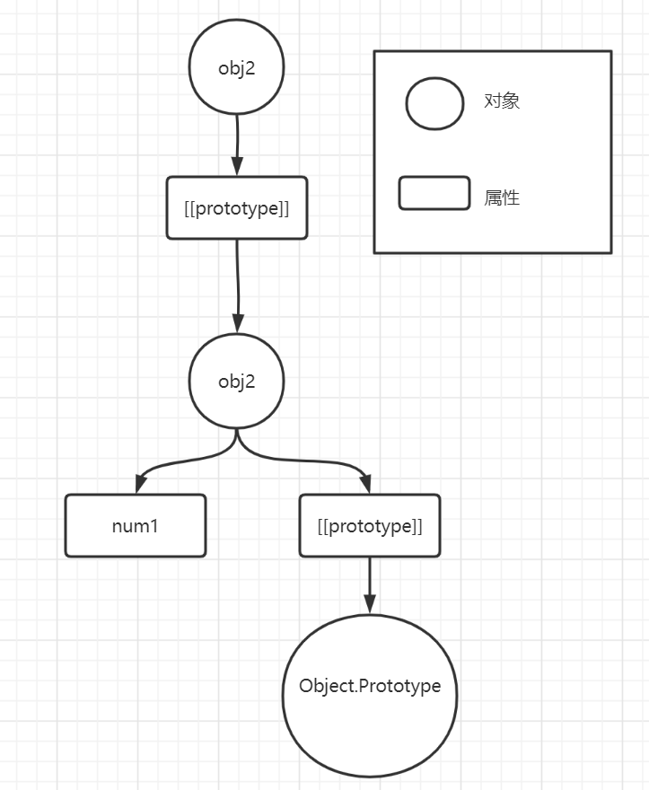
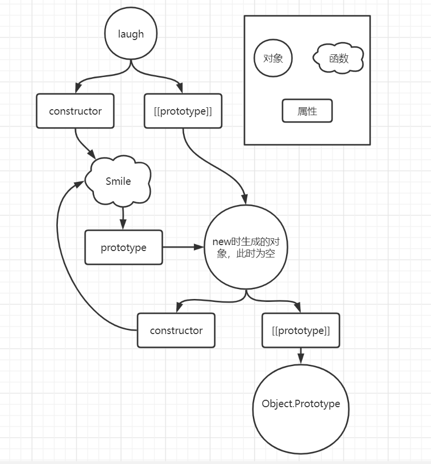

# 原型链
> JS中所有的对象都默认有一个`[[Prototype]]`属性，里面存储的是对其它对象的`引用`。  
> 而JS中所有的`内置对象`（`Function`、`Array`等）都是基于`Object.prototype`这个对象来实现的。所以`链的尽头`就是`Object.prototype`。  
> 这种环环相扣的结构很像一条锁链，所以被称为`原型链`。


## 为什么要这么链接呢？
当我们在一个对象上，没找到需要的`属性`或`方法`时，就会沿着`[[Prototype]]`指向的对象继续找，找到就返回，没找到返回undefined。这就是链的作用。

## 如何自己创建链接呢？
> 如果我们想把自己定义的两个对象通过原型链的方式链接起来，该怎么做呢？

通过`Object.create()`来实现。
```javascript
var obj1 = {
  num1: 1
}

var obj2 = Object.create(obj1);
```
上述代码中`Object.create()`的执行过程：
+ 先创建一个对象
+ 这个对象的`[[prototype]]`关联到`obj1`
+ 返回这个对象

这个返回的对象就赋值给了`obj2`，所以`obj2`的`[[prototype]]`关联到`obj1`。  
  
**原型链图示：**  


## 给原型链上存在的属性赋值会发生什么？
> 不要弄混哦，这里是赋值。取值的话就沿着链直接取，返回第一个找到的，与作用域RHS查询一样。
### 链上的属性不是只读
> 如果在prototype链上层有同名属性且不是只读，那就会在当前对象上添加一个同名属性

```javascript
var obj1 = {
  num1: 1
};

var obj2 = Object.create(obj1);

obj2.num1 = 2; // 会直接在obj2上创建一个num1，不会覆盖obj1

console.log(obj2.num1); // 2
console.log(obj1.num1); // 1

// 这些是为什么后面的章节中，使用对象可以实现继承的原因
```
### 链上的属性是只读
> `非严格模式`下赋值语句被忽略。
> `严格模式`下抛出错误。

```javascript
var obj1 = {
  num1: 1
};

// 设置只读
Object.defineProperty(obj1, 'num1', {
  writable: false
});

var obj2 = Object.create(obj1);

obj2.num1 = 2; // 赋值失败

console.log(obj2.num1); // 1  沿着链往上找，找到了num1返回
console.log(obj1.num1); // 1
```

## __proto__与prototype的区别是什么？
> `__proto__`与`prototype`本质上没有区别都是用来存储对其它对象的`引用`。  
> `__proto__`是所有对象都具有的属性（也就是前面说的`[[prototype]]`）。  
> `prototype`是只有函数才具有的属性。  

下面通过代码和图示来展示一下函数中的链式关系，和上面的对象链式关系做个对比:  

在这之前，再回顾一下，`在new 一个函数时发生了什么？`  
1. 创建一个`新对象`
2. `新对象`的`[[ prototype ]]`连接到函数的`prototype`
3. 然后确认函数的返回值
   + 如果函数return不是一个对象， 把`this`指向创建的`新对象`，然后执行构造函数（使用`this.`赋值的属性会放进新对象）
   + 如果函数`return`一个对象，`new`调用的函数调用会返回这个对象，并**丢弃**之前创建的`新对象`
4. 结束

**函数链接关系**：
```javascript
function Smile() {
  this.name = 'Jack';
}

var laugh = new Smile();

console.log(laugh.name); // Jack
```
**原型链图示**：  


可以看出和对象链相比，函数因为多了一个`prototype`属性，链要复杂一点。（复杂还有一个原因，函数还多了一个constructor属性，但就是把constructor属性去除，还是要比对象链复杂一点）