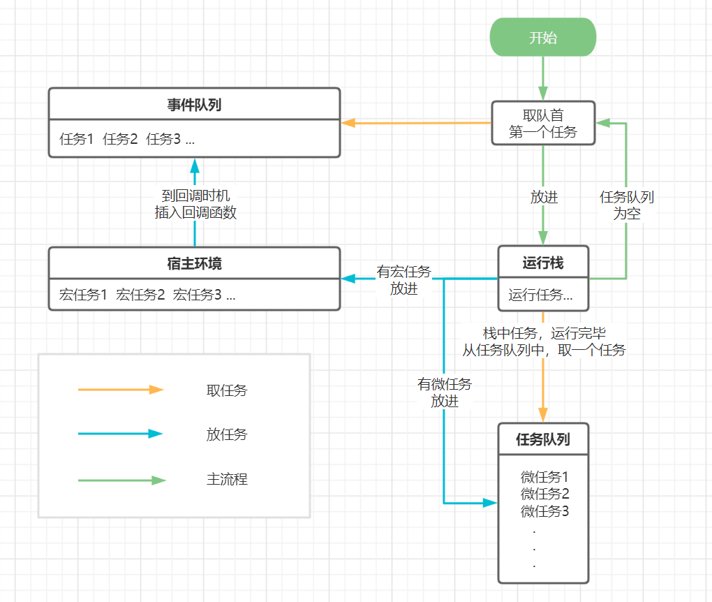

# 事件循环
> 由于`JS`是同步执行的单线程语言，没有异步概念。  
> JS做的就是一直`循环`的从`事件队列`中拿出第一个任务，放到`运行栈`中去运行。
> 这样循环往复的行为就被称为：`事件循环`(`Event Loop`)

<!-- 这样的一个循环被称为一个`tick` -->

## 如何实现异步呢？
> `JS`中的异步有两种情况：  
> 宏任务：通过`宿主环境`（浏览器/node）配合来实现的。  
> 微任务：通过在`运行栈`后，`事件队列`前，加入一个`任务队列`来实现。

### 宏任务
> 就像一家生意火爆的火锅店，很多人在排队（事件队列），服务员喊号，到号的人进去开心的吃火锅（运行栈）。  
> 等了很久终于叫到了你，但你突然有件急事要花半个小时解决，不能进去吃。火锅店又不可能等你半个小时，这时你跟服务员说（告诉宿主环境）。你重新帮我排个号吧（添加宏任务，等同于`setTimeout(排号, 0)`），服务员拿出小pad帮我重新排了号，我现在又进到了队伍的最后，等待重新叫号....
+ `JS`执行到`异步函数`（假设为`setTimeout`），把`回调函数`告诉宿主环境，并告诉他什么时机插入`事件队列`
+ `宿主环境`到了`JS`告诉的时机，把`回调函数`插入到`事件队列`
+ `JS`在下一个`事件循环`中，把`事件队列`中的第一个任务放到`运行栈`进行执行，就能执行到这个`回调函数`

### 微任务
> 你进入了火锅店（运行栈），开始吃火锅（本次的任务）。但吃火锅的过程中你可以做很多事，拿调料、等朋友、叫服务员加菜...（微任务，加入任务队列）在你没吃完之前，下一个人没法到你这个座位吃饭（事件队列中的任务要等），只要脸皮够厚，可以吃到火锅店关门...（这就是微任务的弊端）
+ 引进一个新队列：`任务队列`（里面的任务，在完成`运行栈`的任务后，从`事件队列`拿下一个任务前进行执行）
+ `微任务`，插入到`任务队列`（Promise就是微任务）
+ 只有`运行栈`和`任务队列`中没有任务，才会重新从`事件队列`中取出下一个任务
  

**总结一下**，在整个JS的事件循环中，共用到了**2个队列,一个运行栈**：  
1. `事件队列`（里面存放：`同步任务`和`宏任务的回调`）
2. `任务队列`（里面存放：执行`微任务`时插入的任务。`运行栈`执行完之后先从这里取任务执行）
3. `运行栈`（先从`事件队列`中取的一个任务，执行过程中又会往`事件队列`和`任务队列`中插入任务，执行完从`任务队列`取任务，`任务队列`中也没任务，就进入下一个循环）

## 事件循环完整流程图 



## 整几道题感受下事件循环

### 1. 写出相应的输出结果
```javascript
// 只有微任务
const promise = new Promise((resolve, reject) => {
  console.log(1); // 同步代码
  resolve()
});

promise.then(() => {
  console.log(2); // .then异步代码（微任务，放入任务队列）
});

console.log(3); // 同步代码

// 结果：1 3 2
```

```javascript
// 只有宏任务
console.log(1); // 同步代码

// 异步代码（宏任务，交给宿主环境，并告诉他1000ms后插入事件队列）
setTimeout(() => {
  console.log(2);
}, 1000);

console.log(3); // 同步代码

// 结果：1 3 2
```

```javascript
// 微任务、宏任务结合

// 异步代码（宏任务，交给宿主环境，并告诉他1000ms后插入事件队列）
setTimeout(() => {
  console.log(1);
}, 1000);

const promise = new Promise((resolve, reject) => {
  console.log(2); // 同步代码
  resolve()
});

promise.then(() => {
  console.log(3); // .then异步代码（微任务，放入任务队列）
});

console.log(4); // 同步代码

// 结果：2 4 3 1
```

```javascript
// 最后一道大家自己试着分析一下
console.log('start');

setTimeout(() => {
  console.log('timer1');

  new Promise((reslove, reject) => {
    console.log('promise');
    reslove();
  }).then(() => {
    console.log('then');
  });

}, 0);

setTimeout(() => {
  console.log('timer2')
}, 0);

console.log('end');

// 结果：start end timer1 promise then timer2
```

### 2. 实现一个LazyMan
实现一个LazyMan()，可以实现一下效果：
```javascript
LazyMan('Jack');
// hi, I am Jack


LazyMan('Jack').eat('dinner');
// hi, I am Jack
// eat dinner


LazyMan('Jack').sleep(1000).eat('dinner');
// hi, I am Jack
// wait 1000ms
// eat dinner


LazyMan('Jack').eat('dinner').sleepFirst(1000);
// wait 1000ms
// hi, I am Jack
// eat dinner
```

```javascript
// 实现
class lazyMan {
  constructor(name) {
    this.task = [];

    this.sayHi(name);
    
    setTimeout(() => {
      this.next();
    }, 0)
  }

  next() {
    let task = this.task.shift();
    task && task();
  }

  sayHi(name) {
    let task = () => {
      console.log(`hi, I am ${name}`);
      this.next();
    };
    this.task.push(task)
  }

  eat(food) {
    let task = () => {
      console.log(`eat ${food}`);
      this.next();
    };
      
    this.task.push(task);
    return this;
  }

  sleep(time) {
    let task = () => {
      setTimeout(() => {
        console.log(`wait ${time}ms`);
        this.next();
      }, time)
    }
    this.task.push(task);
    return this;
  }

  sleepFirst(time) {
    let task = () => {
      setTimeout(() => {
        console.log(`wait ${time}ms`);
        this.next();
      }, time)
    }
    this.task.unshift(task);
    return this;
  }
}

function LazyMan(name) {
  return new lazyMan(name);
}


// 测试效果
LazyMan('jack').sleep(1000).eat('dinner').sleepFirst(1000);
```