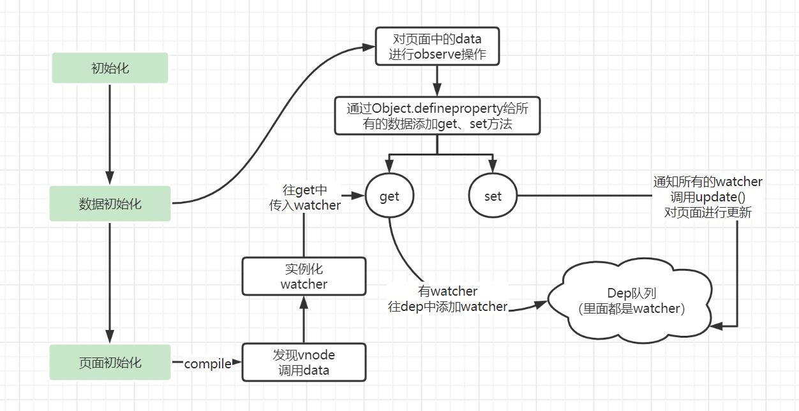

# Vue如何实现双向绑定

## 正向（data->view）
> 通过`Object.defineProperty(obj, prop, descriptor)`实现。
> `Vue`在初始化数据的时候，会把`data`中的所有属性使用`Object.defineProperty`重新定义。

**还不知道`Object.defineProperty`是什么？**
+ [参考`Getter和Setter`](./../JS/07对象.md)
+ [MDN介绍](https://developer.mozilla.org/zh-CN/docs/Web/JavaScript/Reference/Global_Objects/Object/defineProperty)

**`Object.defineProperty`的缺点**
+ 深度监听，需要递归到底，一次性计算量大
+ 无法监听新增、删除属性（Vue.set/Vue.delete）
    > vue3.0使用proxy解决了此问题，但低版本浏览器不兼容性
+ 无法监听数组
    > vue3.0使用proxy解决了此问题，但低版本浏览器不兼容性

## 反向（view->data）
> 通过input事件实现

    
# 拓展问题

## 双向绑定使用的设计模式是什么？
> `观察者模式`：又被称为 `发布-订阅者模式`或`消息机制`，定义了对象间的一种`一对多的依赖关系`，只要当一个对象的状态发生改变时，所有依赖于它的对象都得到通知并被自动更新，解决了主体对象与观察者之间功能的耦合，即一个对象状态改变给其他对象通知的问题

**步骤**：  
+ 实例化的过程中会在data挂载到option后，对数据进行`observe`
+ `observe`中遍历数据，对每个key使用`Object.defineproperty`添加get、set方法
  + `get`方法判断有无传入`watcher`，有的话往`dep`队列添加`watcher`
  + `set`中通知`dep`让所有`watcher`调用`update()`
+ `compile`过程中会对vnode进行判断，如果调用data中的key，就会实例化`watcher`
  + `watcher`实例化的过程中调用对应key的get方法，会触发往dep中添加`watcher`

## Vue如何检测数组变化？
> `Object.defineproperty`不支持数组
+ 修改数组原型链的方法，方法名称与原方法相同
  + `push`、`shift`、`unshift`、`pop`、`splice`、`sort`、`reverse`
+ 当调用数组对应的方法时，修改后的方法，会先调用原生数组对应的方法，然后通知视图更新（`dep.notify()`）
+ 若数组中包含对象，会对对象进行遍历，进行object.defineProperty

**注**：Vue3.0后使用proxy进行数据监听，不再使用上述方法
## object.defineProperty()与reflect.defineProperty()的区别是什么？
+ `Object.defineProperty()`是ES5中，`reflect.defineProperty()`是ES6中
+ `Object.defineProperty()`返回值是对象，`reflect.defineProperty()`返回值是boolean值

